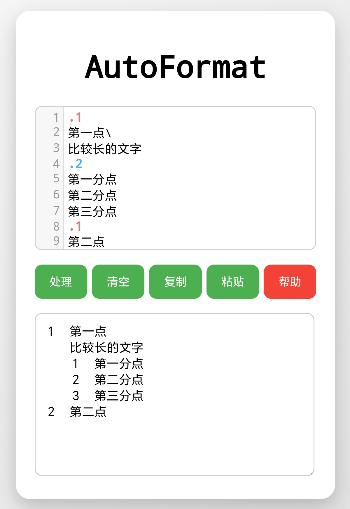
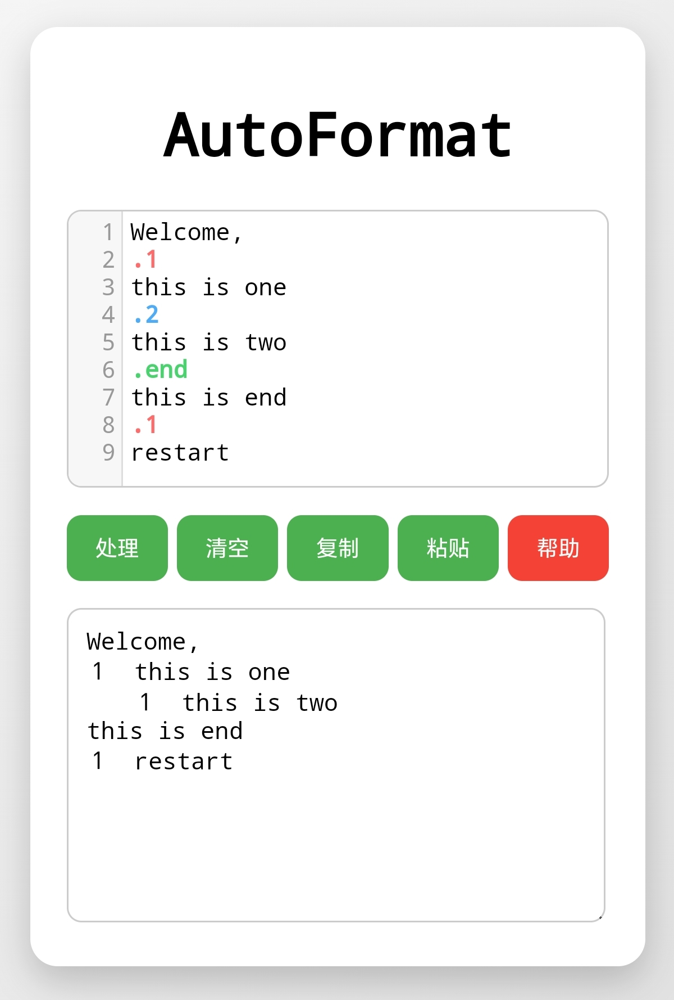

# AutoFormat-html
This tool can be formatted by automatically inserting full-width punctuation. Simply open AutoFormat.html online with a browser to use it. 
这个工具可通过运用自动插入全角符号以实现网页文本的格式化。只需用浏览器在线打开format.html即可使用。 
 
下载位置：[main](https://github.com/ldlsn1/AutoFormat-html/tree/main/main)
 
　　
You can use it like this:

  <table>
    <tr>
      <td></td>
      <td></td>
    </tr>
  </table>

